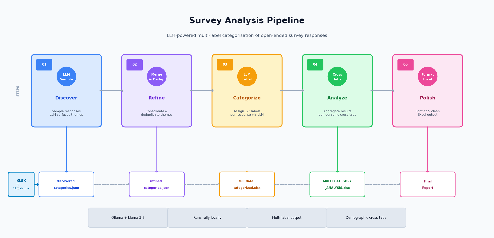

# Survey Data Analysis — Multi-Category LLM Pipeline

End-to-end pipeline for analyzing open-ended survey responses using a local LLM (Ollama / Llama 3.2).
Processes raw free-text answers into structured, multi-label categories and produces a formatted Excel report with demographic cross-tabs.

**Key capability:** each response can carry *multiple* categories simultaneously, capturing the full richness of feedback rather than forcing a single label per answer.

---

## Pipeline

```mermaid
flowchart LR
    IN([📊 full_data.xlsx])

    subgraph S1["Step 1 — Discover"]
        direction TB
        S1L["1_discover_categories_multi.py"]
        S1D["Sample responses → LLM → candidate themes"]
    end

    subgraph S2["Step 2 — Refine"]
        direction TB
        S2L["2_refine_categories.py"]
        S2D["Consolidate & deduplicate themes"]
    end

    subgraph S3["Step 3 — Categorize"]
        direction TB
        S3L["3_categorize_multi.py"]
        S3D["Assign 1–3 labels per response via LLM"]
    end

    subgraph S4["Step 4 — Analyze"]
        direction TB
        S4L["4_analyze_multi_categories.py"]
        S4D["Aggregate + demographic cross-tabs"]
    end

    subgraph S5["Step 5 — Polish"]
        direction TB
        S5L["5_analyze_excel.py"]
        S5D["Format & clean Excel output"]
    end

    OUT([📋 MULTI_CATEGORY_ANALYSIS.xlsx])

    F1(["🗂 discovered_categories_multi.json"])
    F2(["🗂 refined_categories_multi.json"])
    F3(["🗂 full_data_multi_category.xlsx"])

    IN --> S1 --> F1 --> S2 --> F2 --> S3
    IN --> S3
    S3 --> F3 --> S4 --> S5 --> OUT
```





Scripts live in `pipeline/` and run in order:

| Step | Script | What it does |
|------|--------|--------------|
| 1 | `1_discover_categories_multi.py` | Samples responses, asks LLM to surface candidate themes |
| 2 | `2_refine_categories.py` | Consolidates and deduplicates themes into a clean taxonomy |
| 3 | `3_categorize_multi.py` | Assigns 1–N categories per response using the taxonomy |
| 4 | `4_analyze_multi_categories.py` | Aggregates results into per-question sheets with demographic breakdowns |
| 5 | `5_analyze_excel.py` | Post-processes the Excel output (removes zero-padding) |

---

## Requirements

```bash
pip install pandas openpyxl requests
```

[Ollama](https://ollama.ai) must be running locally with the Llama 3.2 model:

```bash
ollama pull llama3.2
ollama serve
```

---

## How to Run

```bash
# Place your survey data at: data/full_data.xlsx
# See data/sample_data.xlsx for the expected column structure

cd pipeline
python 1_discover_categories_multi.py
python 2_refine_categories.py
python 3_categorize_multi.py
python 4_analyze_multi_categories.py
python 5_analyze_excel.py
```

Output lands in `output/`.

---

## Project Structure

```
data/               Source data (not committed — private)
                    sample_data.xlsx  ← anonymized 20-row example
pipeline/           Main analysis scripts (steps 1–5)
processed_data/     Intermediate enriched data files (not committed)
intermediate/       LLM-generated category JSON files (not committed)
visualizations/     Charts and graphs (not committed)
output/             Final Excel reports (not committed)
```

---

## Data Privacy

Real survey data is excluded from this repository via `.gitignore`.
`data/sample_data.xlsx` contains 20 **fictional** respondents that mirror the column structure for demonstration purposes only.
